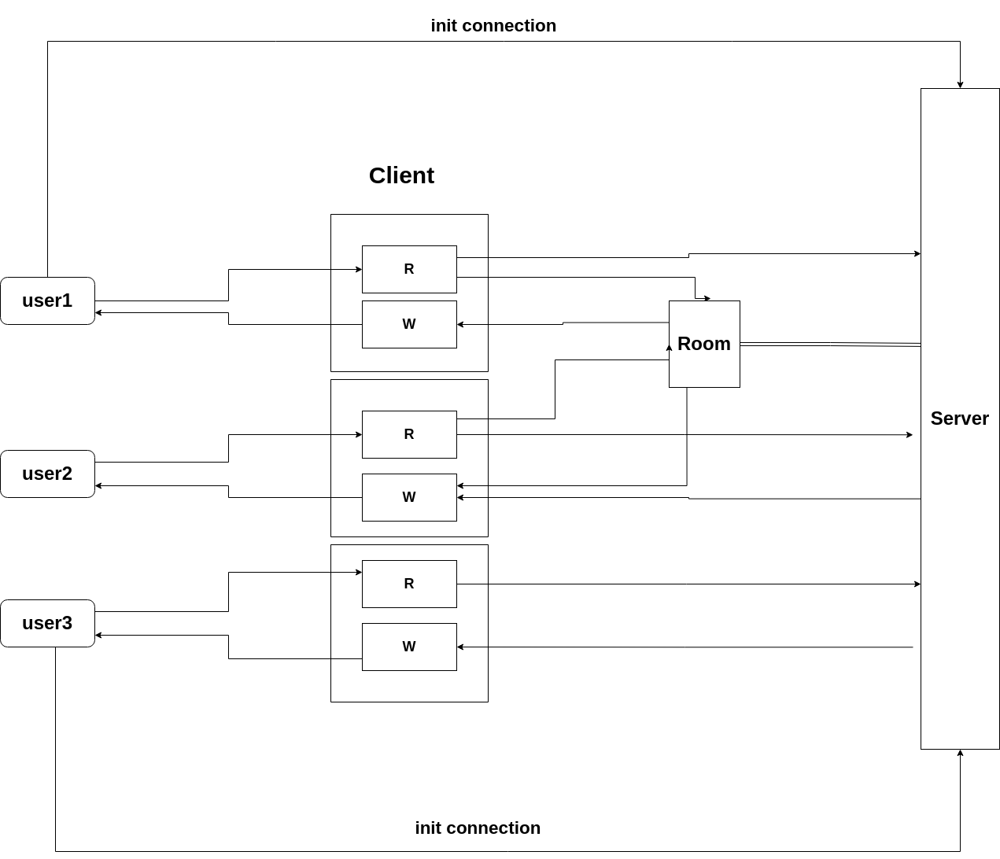

## System structure

In this project we use simple b/s structure to support multi-pairs players playing Gomoku at the same time

1. Frontend:

2. Backend:
   Backend is written in golang using goruntine and channels to support concurrency. The detail implementation is narrated in "How to support concurrency" part.

## C/S communication

We use websocket protocol to build a steady channel between browser and server

1.  message from user:

    ```
    //3 different actions: "play-pawn", "join-room", "leave-room"
    Action   string `json:"action"`
    RoomName string `json:"message"`
    X        int32  `json:"x"`
    Y        int32  `json:"y"`
    ```

    Besides actions above, user can also disconnect the websocket connection without notifying server.

2.  message from server
    user can parse the json file in websocket connection to sync with other players
    this structure bellow maintains the metadata of a gomoku Room
    the 10-by-10 board is encoded in a single row 100 bytes array

        RoomName      string    `json:"roomName"`
        Player        int32     `json:"player"`
        Player1Online bool      `json:"player1Online"`
        Player2Online bool      `json:"player2Online"`
        Turn          int32     `json:"turn"`
        Board         [100]byte `json:"board"`

## How to support multiple players concurrently

We use 3 diffenrent kinds of threads to support multi-players in multi-rooms.

1. server thread
   1. handle http handleshake and upgrade it to websocket connection
   2. maintain users' and rooms' registration
2. client thread
   > the client thread consists of 2 sub threads:
   1. read thread: read data from user and send them to correct handler
   2. write thread: send msg back to user
3. room thread
   > room thread maintain the metaData of a gomoku game, including players' info, game info.
   1. handle user join/leave room
   2. handle user play a pawn in the room


